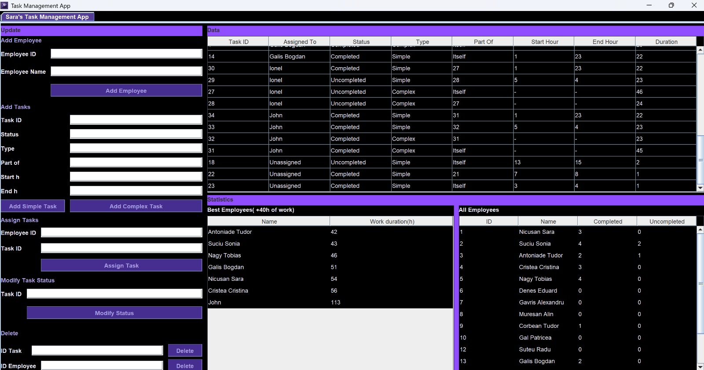

# Task Management App

A desktop task management application built in Java, designed to manage employees, assign and monitor tasks, update task status, and generate useful productivity statistics through an intuitive interface.

---

 Features

- Add and manage employees
- Create simple and complex tasks
- Assign tasks to employees
- Track task status (Completed / Uncompleted)
- View work statistics and performance
- User-friendly interface

---

 Application Interface



---

 Technologies Used

- Java
- Maven
- Swing / JavaFX (depinde ce ai folosit)
- IntelliJ IDEA

---

 How to Run

1. Clone the repository:
```bash
git clone https://github.com/USERNAME/REPO.git